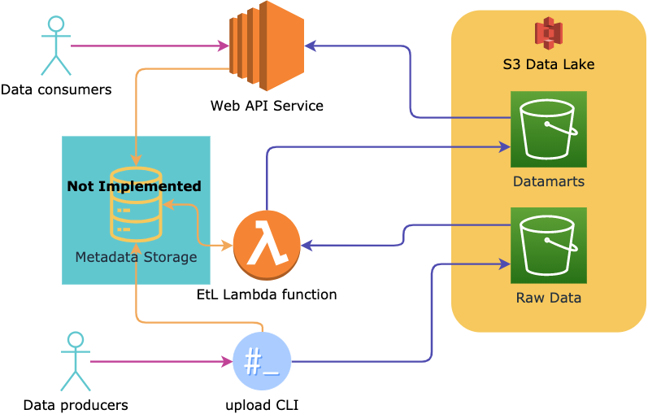

## Runbook

### Prerequisites

- `jq` tool installed locally
- `python` 3.7+ and `pip` installed locally
- AWS account with programmatic access (key and secret key)
- SSH puplic key is uploaded to AWS EC2 console

### Setup

### Challenge 1 

- run: `cd challenge-1 && make init` - if AWS account wasn't set up it will ask you interactivelly
- modify `infrastructure/config.yml` file:
    - change name to your uploaded SSH key name (`aws_ssh_key`)
    - change path to raw test example data: `test_data_file` (not necessary for challenge 1)
- run: `make`
- wait for complete and follow the instructions how to test APIs

make command will:
- build necessary infrastructure
- upload raw data to S3 storage
- run preprocessing AWS lambda job synchronously
- run the web service
- print the instructions how to test APIs and check their specification

### Challenge 2

the steps are the same as for challenge 1.

## Architectural decisions

## Challenge 1

- The following principles were used:
    - use Data Lake instead of DWH
    - abstract raw data via Data Marts
    - implement data processing in a manual batch mode
- data versioning, data lineage, metadata service weren't implemented due to challenge time limits
- since the data volume is small no distributed data processing was used. Horizontal scaling can still be achieved but if the data volume will be bigger than in test cases, the solution needs to be reworked completelly.
- since the data transformation worklow is simple, sigle serverless function was used. In case it will evolve to a more complex one, it should be replaced by a proper worklow manager (Apache Airflow, AWS Step Function, etc.)
- infrastructure is managed via Ansible and make tools. make builds lambda layer and function and orchestrates overall workflow. Ansible builds most of the AWS infrastructure.
- push based configuration approach
- FastAPI Python framework on EC2 instance is used for Web service
- To increase performance the data is cached locally on a web server FS. Since the data is uncheangable, no cache invalidation is needed. But cache eviction must be implemented.

## Challenge 2

- DynamoDB was used as a database of choice, mainly because data query use cases were simple and it is easy to setup. It's generally not suited for OLAP activities, but for this scenario it might be well suited, perfomance and pricing testing need to be conducted.
